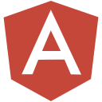

  <samp>
    Hi, I'm Mounib! 👋  
    🔥 24 Year's Old Software Developer grinding hard to make something cool   
    :email:	bymounib1997@gmail.com  
    :art: Portfolio: https://mounib-iben-yamna.netlify.app/  
    :briefcase: LinkedIn: https://linkedin.com/in/bymounib  
  </samp>

## Languages and Tools :

 

